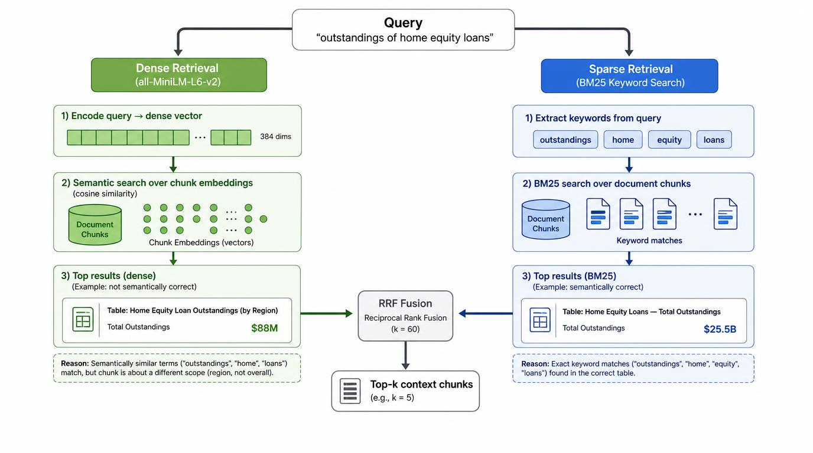

### FinRAG-Multimodal

RAG pipeline for financial documents (SEC filings) where every number in the answer is verified separately — without an LLM.

The core idea is simple: you cannot trust LLMs with numbers. Therefore, after generation, an independent validator mathematically cross-checks every claimed number against what actually exists in the context. If the number is missing from the source — status `validation_failed`. If the data is completely absent — `not_found`. No "approximately" and no "most likely".

### What actually works

- On a small smoke eval set (5 questions), the system yields **100% accuracy**.
- Out-of-domain questions are handled via controlled refusal.
- Numerical hallucinations are caught by an external validator (standard regex + normalization, zero LLM involvement).
- **Retrieval:** Hybrid (dense `all-MiniLM-L6-v2` + BM25), fused via Reciprocal Rank Fusion (RRF).
- **Generation:** `qwen2.5:7b` via Ollama, `temperature=0`, forced JSON output.
- **Observability:** LangFuse tracing per pipeline stage.

### Why hybrid retrieval is not optional (a real bug we fixed)

After adding BM25 + RRF, the exact keyword `outstandings` surfaced the correct table.
The system now answers **$25.5B**, and the validator confirms it against the source.
Specific bug, specific fix.



With pure dense-only search, the question:
*"What were the outstandings of home equity loans at December 31, 2023?"*
returned a table with **$88M** — semantically close, but factually wrong (it was a table of modified loans).

After adding BM25 + RRF, the exact keyword `outstandings` surfaced the correct table. The system now answers **$25.5B**, and the validator confirms it against the source. Specific bug, specific fix.

```
### Architecture


```text
PDF
  → Docling (layout-aware parsing)
  ...

```text
PDF
  → Docling (layout-aware parsing)
  → ParsingArtifact (Pydantic, with page / bbox / source_ref)
  → Chunking (3 strategies: text-only / docling-hybrid / table-aware parent-child)
  → Qdrant (dense) + BM25 (sparse) → RRF fusion
  → Ollama qwen2.5:7b (strict JSON, temp=0)
  → External Numerical Validator
  → LangFuse (tracing)
```

### Quickstart

Requires: Docker, Ollama with `qwen2.5:7b`, LangFuse keys (cloud or self-hosted).

```bash
# Infrastructure
docker-compose up -d                 # Qdrant
ollama pull qwen2.5:7b               # generation model

cp .env.example .env                 # add your LangFuse keys

pip install -r requirements.txt

# Place your PDF at data/raw/sample.pdf
python scripts/run_parsing.py

# Choose chunking strategy in indexer.py (A / B / C), B is default
python -m src.ingestion.indexer

# Ask a question (hybrid retrieval + validation, traced in LangFuse)
python scripts/ask_rag.py "What were the outstandings of home equity loans at December 31, 2023?"

# Run smoke evaluation
python scripts/evaluate.py
```

### Project structure

```text
src/
  core/models.py          # Pydantic schemas
  ingestion/
    parser.py             # Docling + table grouping heuristic
    chunking.py           # 3 chunking strategies
    embedder.py           # SentenceTransformer wrapper
    indexer.py            # Qdrant batched upserts
  retrieval/
    hybrid_search.py      # Dense + BM25 + RRF fusion
  generation/
    llm_client.py         # Ollama client, forced JSON
    validator.py          # External Numerical Validator
scripts/
  run_parsing.py          # PDF -> ParsingArtifact JSON
  ask_rag.py              # E2E pipeline + LangFuse tracing
  evaluate.py             # Smoke eval over data/eval_dataset.json
data/
  eval_dataset.json       # Smoke set: positive, negative, and trick questions
```

### Known limitations (the honest list)

- Docling sometimes flattens multi-level table headers (e.g., `Total.December 31, 2023`).
- Complex tables can degrade into flat pipe-separated text.
- Eval set is currently a smoke set (5 questions). A proper 50–100 question dev set is the next step.
- CPU inference takes 10–60 seconds per generation.
- SEC Form 4 (coordinate-based tables) is not supported yet.

### Backlog

- Native Qdrant sparse vectors (replace in-memory BM25)
- Cross-encoder reranker for top-K
- RAGAS metrics on a proper dev eval set
- Coordinate-based parser for SEC Form 4
- Agentic decomposition for multi-document comparison queries

### Stack

Python 3.10 · Docling 2.x · Pydantic 2 · Qdrant 1.7.4 (client 1.8.2) · 
sentence-transformers · rank-bm25 · Ollama (qwen2.5:7b) · LangFuse
```
### Docker (optional, for other machines)

The app ships with a `Dockerfile` and a compose `app` service for reproducibility
on other machines or CI. Locally, the venv quickstart above is the primary path.

```bash
docker-compose up -d
docker-compose --profile run build
docker-compose --profile run run --rm app python -m src.ingestion.indexer
docker-compose --profile run run --rm app python scripts/ask_rag.py "your question"